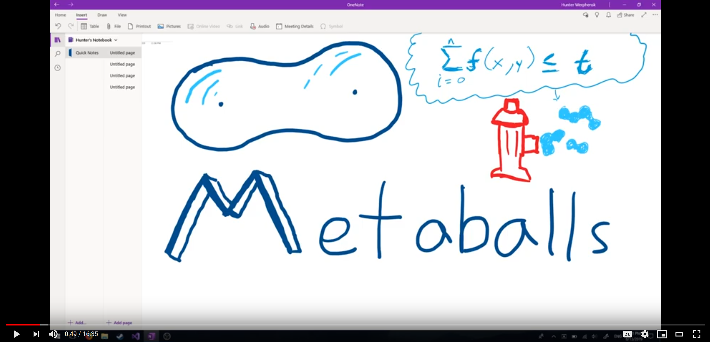

<p align="center"></p>

<h4 align="center">Dynamic and Static Implementation of Blinn's "Blobby Surface" Algorithm</p>

[](http://unlicense.org/)
[]()

---

---

## Purpose

This repository was created for the code written and discussed in my first Youtube programming tutorial, as linked below.

<p></p>

---

## How does it work?

I'm glad you asked, as mentioned above I created an introductory video in 2019 about this topic. Feel free to take a look, but I will admit I wish I could go back and fix quite a few things. None the less, that's what the future is for!

[](https://www.youtube.com/watch?v=tEYxodOJadw "Introduction to Metaballs")

## Dependencies

Both of these examples were built using the [SFML 2.5 API](https://www.sfml-dev.org/) for its simplicity and understandability.

## How To Use

1. Clone this repository
2. Link the appropriate SFML 2.5 library

---

## Q&A

### _Q_: Why did you include both a static and dynamic implementation in this repository if you wont cover the GLSL implementation?

**A**: I feel I covered the core basics enough in the static video such that if you understand that video you can understand and implement the GLSL approach. I didn't and don't really want to get into OpenGL too much on my channel as there are [fantastic resources for learning those already](https://learnopengl.com/).

### _Q_: Why did you chose SFML?

**A**: SFML is an API for multi-media applications. It allows us to handle a window instance, OpenGL, and input all in one library and avoid a ton of boiler-plate code. Since I wanted to talk more about the algorithm and how simple it was, I didn't want to muddle that point in a complex API. That said, I more often use SDL2. SFML is a tad cluttered with a lot more overhead.

### _Q_: Why is the window black? I have no error!

**A**: That's one joy about using shaders, they aren't so good at letting you know when there is an issue. However, this is most likely an issue of using the wrong .dlls and can be fixed by ensuring you are using the correct library for your target OS. For example, x64 or x86 must use their respective libraries and if you are building Release/Debug you need to ensure you aren't/are using the [...]-d.dll.

Alternatively, I suggest changing

```c++
metaballShader.loadFromFile("metaballs.vert","metaballs.frag");
```

to something like

```c++
if(!metaballShader.loadFromFile("metaballs.vert","metaballs.frag"))
    std::cout << "ERROR::SHADER::Unable to load shaders\n";
```

This will ensure the issue is with the shaders and narrow things down.
